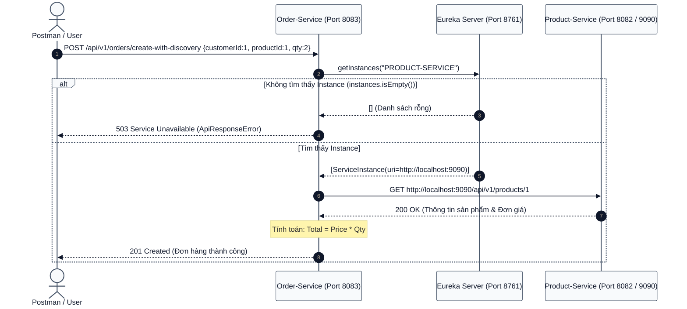

# [BÀI TẬP 3 - GIỎI] TỰ ĐỘNG PHÁT HIỆN VÀ GỌI SERVICE (DISCOVERYCLIENT)

## CƠ CHẾ TRA CỨU ĐỘNG VỚI DISCOVERYCLIENT, XỬ LÝ LỖI 503 SERVICE UNAVAILABLE & KIỂM CHỨNG TÍNH THÍCH ỨNG LINH HOẠT KHI ĐỔI CỔNG PORT

> **Đề bài:** Trong `Order-Service`, thay vì gọi tĩnh `http://localhost:8082`, sử dụng `DiscoveryClient` để hỏi Eureka Server: _"Service PRODUCT-SERVICE đang ở đâu?"_. Nếu không tìm thấy instance nào, xử lý trả về `ApiResponseError` với mã lỗi `503 Service Unavailable`. Đổi port của `Product-Service` sang `9090`, kiểm chứng `Order-Service` vẫn phát hiện và gọi thành công mà không cần sửa code.
> **Bài làm của em:** Phân tích nhược điểm của URL cứng, trình bày kiến trúc truy vấn qua `DiscoveryClient`, thiết kế cấu trúc lỗi `ApiResponseError` chuẩn RESTful, triển khai mã nguồn tại `Order-Service`, và tiến hành 2 kịch bản kiểm thử thực nghiệm chứng minh tính độc lập và khả năng tự thích ứng của hệ thống.

---

## MỤC LỤC

1. [Đặt vấn đề: Từ URL Cứng (Hardcoded URL) tới Tra cứu Động](#1-đặt-vấn-đề-từ-url-cứng-hardcoded-url-tới-tra-cứu-động)
   - 1.1. Lỗ hổng chết người của việc gán chết IP và Port
   - 1.2. Giải pháp: Tra cứu danh bạ động thông qua `DiscoveryClient`
2. [Nguyên lý Hoạt động của `DiscoveryClient`](#2-nguyên-lý-hoạt-động-của-discoveryclient)
   - 2.1. Bản chất của `DiscoveryClient` trong Spring Cloud Commons
   - 2.2. Luồng thực thi: Query Registry $\rightarrow$ Trích xuất URI $\rightarrow$ Gửi HTTP Request
   - 2.3. Caching danh bạ tại Client (Client Cache & Stale Data)
3. [Thiết kế Xử lý Lỗi & Chuẩn hóa Phản hồi 503 Service Unavailable](#3-thiết-kế-xử-lý-lỗi--chuẩn-hóa-phản-hồi-503-service-unavailable)
   - 3.1. Tại sao phải là 503 Service Unavailable thay vì 404 hay 500?
   - 3.2. Cấu trúc chuẩn của `ApiResponseError`
   - 3.3. Bắt lỗi tập trung bằng `@RestControllerAdvice`
4. [Chi tiết Triển khai Mã Nguồn trong `Order-Service`](#4-chi-tiết-triển-khai-mã-nguồn-trong-order-service)
   - 4.1. Định nghĩa DTOs: `ApiResponseError`, `OrderRequestDTO`, `ProductResponseDTO`
   - 4.2. Viết ngoại lệ `ServiceUnavailableException` và `GlobalExceptionHandler`
   - 4.3. Viết `OrderController` với logic tra cứu qua `discoveryClient.getInstances(...)`
5. [Thực nghiệm & Kiểm chứng 2 Kịch bản Kỹ thuật](#5-thực-nghiệm--kiểm-chứng-2-kịch-bản-kỹ-thuật)
   - 5.1. Kịch bản 1: Tắt `Product-Service` $\rightarrow$ Nhận phản hồi lỗi chuẩn 503
   - 5.2. Kịch bản 2: Đổi port của `Product-Service` sang `9090` $\rightarrow$ Tự động gọi thành công mà không cần sửa code
6. [Đánh giá Ưu điểm & Giới hạn của cách tiếp cận `DiscoveryClient` thuần](#6-đánh-giá-ưu-điểm--giới-hạn-của-cách-tiếp-cận-discoveryclient-thuần)
7. [Kết luận của em](#7-kết-luận-của-em)

---

## 1. Đặt vấn đề: Từ URL Cứng (Hardcoded URL) tới Tra cứu Động

### 1.1. Lỗ hổng chết người của việc gán chết IP và Port

Khi viết ứng dụng phân tán, sai lầm phổ biến nhất của người mới học là viết trực tiếp địa chỉ mạng vào mã nguồn:

```java
// CÁCH LÀM SAI TRONG MICROSERVICES
String url = "http://localhost:8082/api/v1/products/" + productId;
ProductResponseDTO product = restTemplate.getForObject(url, ProductResponseDTO.class);
```

Cách làm này tạo ra **sự ràng buộc cứng (Tight Coupling)** nguy hiểm:

1. Nếu `Product-Service` chuyển từ port `8082` sang `9090` (để tránh xung đột hoặc tái cấu trúc), `Order-Service` sẽ lập tức bị gãy vỡ (`ConnectException: Connection refused`).
2. Muốn sửa chữa, kỹ sư phải tìm đến từng dòng code trong `Order-Service`, thay đổi URL, commit lại, build lại và deploy lại dịch vụ.
3. Không thể tận dụng sức mạnh co giãn (Scaling) vì `Order-Service` chỉ biết duy nhất 1 địa chỉ `localhost:8082`.

### 1.2. Giải pháp: Tra cứu danh bạ động thông qua `DiscoveryClient`

```mermaid
%%{init: {"theme":"base","themeVariables":{"background":"#FFFFFF","primaryColor":"#F8FAFC","primaryBorderColor":"#475569","primaryTextColor":"#0F172A","secondaryColor":"#F1F5F9","tertiaryColor":"#E2E8F0","lineColor":"#475569","textColor":"#0F172A","mainBkg":"#F8FAFC","nodeBorder":"#475569","nodeTextColor":"#0F172A","titleColor":"#0F172A","clusterBkg":"#F8FAFC","clusterBorder":"#94A3B8","edgeLabelBackground":"#FFFFFF","labelTextColor":"#0F172A","fontSize":"14px"}}}%%
flowchart TD
    O["<b>ORDER-SERVICE</b><br/>Port: 8083"]
    E["<b>EUREKA REGISTRY</b><br/>Port: 8761"]
    P["<b>PRODUCT-SERVICE</b><br/>Port: 9090 <i>(Đổi port linh hoạt)</i>"]

    O -->|1. discoveryClient.getInstances('PRODUCT-SERVICE')| E
    E -->|2. Trả về metadata: URI http://192.168.1.10:9090| O
    O -->|3. HTTP GET http://192.168.1.10:9090/api/v1/products/1| P
    P -->|4. Phản hồi dữ liệu JSON| O

    classDef service fill:#F8FAFC,stroke:#475569,stroke-width:1px,color:#0F172A
    classDef registry fill:#E2E8F0,stroke:#0F172A,stroke-width:2px,color:#0F172A
    class O,P service
    class E registry
```

Thay vì tự quyết định gọi đi đâu, `Order-Service` chỉ cần nhớ tên trừu tượng (Service ID) là `PRODUCT-SERVICE`. Khi cần dữ liệu, nó thực hiện:

1. Hỏi Eureka: _"PRODUCT-SERVICE hiện tại đang chạy ở IP và Port nào?"_
2. Eureka trả về danh sách các Instance khả dụng.
3. `Order-Service` lấy URI thực tế và thực hiện cuộc gọi.

---

## 2. Nguyên lý Hoạt động của `DiscoveryClient`

### 2.1. Bản chất của `DiscoveryClient` trong Spring Cloud Commons

`DiscoveryClient` là một giao diện (Interface) trừu tượng nằm trong gói `org.springframework.cloud.client.discovery`. Nó cung cấp phương thức thống nhất:

```java
List<ServiceInstance> getInstances(String serviceId);
List<String> getServices();
```

Khi chúng ta sử dụng `spring-cloud-starter-netflix-eureka-client`, Spring Boot tự động cung cấp đối tượng hiện thực cụ thể là `EurekaDiscoveryClient`. Nếu sau này doanh nghiệp chuyển từ Eureka sang HashiCorp Consul hoặc Apache Zookeeper, toàn bộ mã nguồn sử dụng `DiscoveryClient` vẫn giữ nguyên mà không cần sửa một dòng code nào.

Mỗi đối tượng `ServiceInstance` đại diện cho một bản thể dịch vụ đang chạy, chứa các metadata quan trọng:

- `getServiceId()`: Tên ứng dụng (`PRODUCT-SERVICE`).
- `getHost()`: Địa chỉ IP hoặc hostname (`192.168.1.10`).
- `getPort()`: Cổng lắng nghe (`8082` hoặc `9090`).
- `getUri()`: Đường dẫn URI hoàn chỉnh (`http://192.168.1.10:8082`).

### 2.2. Luồng thực thi: Query Registry $\rightarrow$ Trích xuất URI $\rightarrow$ Gửi HTTP Request

Quy trình xử lý một yêu cầu đặt hàng khi có sự can thiệp của `DiscoveryClient`:



---

## 3. Thiết kế Xử lý Lỗi & Chuẩn hóa Phản hồi 503 Service Unavailable

### 3.1. Tại sao phải là 503 Service Unavailable thay vì 404 hay 500?

Trong thiết kế REST API chuyên nghiệp:

- **`404 Not Found`**: Dùng khi bản ghi dữ liệu không tồn tại (ví dụ: Sản phẩm có ID 999 không có trong database). Nó biểu thị lỗi của phía Client gửi sai định danh.
- **`500 Internal Server Error`**: Biểu thị lỗi lập trình nội bộ không lường trước (ví dụ `NullPointerException`, lỗi cú pháp SQL).
- **`503 Service Unavailable`**: Mã HTTP chuẩn chỉ ra rằng máy chủ hiện tại không thể phục vụ yêu cầu do **một dịch vụ phụ thuộc phía sau tạm thời không khả dụng hoặc bị quá tải**. Đây chính xác là bản chất khi Eureka không tìm thấy `PRODUCT-SERVICE`.

### 3.2. Cấu trúc chuẩn của `ApiResponseError`

Phản hồi lỗi phải rõ ràng, cung cấp đầy đủ ngữ cảnh để đội ngũ Client (Frontend/Mobile) hoặc Gateway dễ dàng nhận diện nguyên nhân:

```json
{
  "timestamp": "2026-09-22T11:48:00.123456",
  "status": 503,
  "error": "Service Unavailable",
  "message": "503 Service Unavailable: Không tìm thấy instance nào của PRODUCT-SERVICE trên Eureka Server",
  "path": "/api/v1/orders/create-with-discovery"
}
```

### 3.3. Bắt lỗi tập trung bằng `@RestControllerAdvice`

Thay vì dùng khối `try-catch` cục bộ rải rác trong Controller, chúng ta tách biệt hoàn toàn bằng cơ chế bắt lỗi toàn cục của Spring MVC (`@RestControllerAdvice`). Bất cứ khi nào tầng logic ném ra `ServiceUnavailableException`, nó sẽ tự động bị chặn lại và chuyển đổi thành `ResponseEntity<ApiResponseError>` kèm HTTP status `503`.

---

## 4. Chi tiết Triển khai Mã Nguồn trong `Order-Service`

### 4.1. Định nghĩa DTOs: `ApiResponseError`, `OrderRequestDTO`, `ProductResponseDTO`

#### a. Lớp `ApiResponseError.java`:

```java
package com.rikkei.orderservice.dto;

import lombok.AllArgsConstructor;
import lombok.Builder;
import lombok.Data;
import lombok.NoArgsConstructor;
import java.time.LocalDateTime;

@Data
@NoArgsConstructor
@AllArgsConstructor
@Builder
public class ApiResponseError {
    private int status;
    private String error;
    private String message;
    private String path;
    private LocalDateTime timestamp;
}
```

#### b. Lớp `ProductResponseDTO.java`:

```java
package com.rikkei.orderservice.dto;

import lombok.AllArgsConstructor;
import lombok.Builder;
import lombok.Data;
import lombok.NoArgsConstructor;
import java.math.BigDecimal;

@Data
@NoArgsConstructor
@AllArgsConstructor
@Builder
public class ProductResponseDTO {
    private Long id;
    private String name;
    private BigDecimal price;
    private Integer stockQuantity;
    private String description;
}
```

#### c. Lớp `OrderRequestDTO.java`:

```java
package com.rikkei.orderservice.dto;

import lombok.AllArgsConstructor;
import lombok.Builder;
import lombok.Data;
import lombok.NoArgsConstructor;

@Data
@NoArgsConstructor
@AllArgsConstructor
@Builder
public class OrderRequestDTO {
    private Long customerId;
    private Long productId;
    private Integer quantity;
}
```

### 4.2. Viết ngoại lệ `ServiceUnavailableException` và `GlobalExceptionHandler`

#### a. Custom Exception:

```java
package com.rikkei.orderservice.exception;

public class ServiceUnavailableException extends RuntimeException {
    public ServiceUnavailableException(String message) {
        super(message);
    }
}
```

#### b. Bộ xử lý ngoại lệ toàn cục:

```java
package com.rikkei.orderservice.exception;

import com.rikkei.orderservice.dto.ApiResponseError;
import jakarta.servlet.http.HttpServletRequest;
import org.springframework.http.HttpStatus;
import org.springframework.http.ResponseEntity;
import org.springframework.web.bind.annotation.ExceptionHandler;
import org.springframework.web.bind.annotation.RestControllerAdvice;
import java.time.LocalDateTime;

@RestControllerAdvice
public class GlobalExceptionHandler {

    @ExceptionHandler(ServiceUnavailableException.class)
    public ResponseEntity<ApiResponseError> handleServiceUnavailable(
            ServiceUnavailableException ex, HttpServletRequest request) {

        ApiResponseError error = ApiResponseError.builder()
                .status(HttpStatus.SERVICE_UNAVAILABLE.value())
                .error(HttpStatus.SERVICE_UNAVAILABLE.getReasonPhrase())
                .message(ex.getMessage())
                .path(request.getRequestURI())
                .timestamp(LocalDateTime.now())
                .build();

        return ResponseEntity.status(HttpStatus.SERVICE_UNAVAILABLE).body(error);
    }
}
```

### 4.3. Viết `OrderController` với logic tra cứu qua `discoveryClient.getInstances(...)`

```java
package com.rikkei.orderservice.controller;

import com.rikkei.orderservice.dto.OrderRequestDTO;
import com.rikkei.orderservice.dto.ProductResponseDTO;
import com.rikkei.orderservice.exception.ServiceUnavailableException;
import com.rikkei.orderservice.model.Order;
import lombok.RequiredArgsConstructor;
import lombok.extern.slf4j.Slf4j;
import org.springframework.cloud.client.ServiceInstance;
import org.springframework.cloud.client.discovery.DiscoveryClient;
import org.springframework.http.HttpStatus;
import org.springframework.http.ResponseEntity;
import org.springframework.web.bind.annotation.*;
import org.springframework.web.client.RestClientException;
import org.springframework.web.client.RestTemplate;

import java.math.BigDecimal;
import java.time.LocalDateTime;
import java.util.List;

@Slf4j
@RestController
@RequestMapping("/api/v1/orders")
@RequiredArgsConstructor
public class OrderController {

    private final DiscoveryClient discoveryClient;
    private final RestTemplate restTemplate;

    @PostMapping("/create-with-discovery")
    public ResponseEntity<Order> createOrderWithDiscovery(@RequestBody OrderRequestDTO request) {
        log.info("Bắt đầu quy trình tạo đơn hàng cho Customer: {}, Product: {}",
                 request.getCustomerId(), request.getProductId());

        // 1. Dùng DiscoveryClient hỏi Eureka Server về PRODUCT-SERVICE
        List<ServiceInstance> instances = discoveryClient.getInstances("PRODUCT-SERVICE");

        // 2. Xử lý lỗi: Nếu không tìm thấy instance nào -> Ném ngoại lệ 503
        if (instances == null || instances.isEmpty()) {
            log.error("Không tìm thấy instance nào của PRODUCT-SERVICE trên Eureka Server!");
            throw new ServiceUnavailableException(
                "503 Service Unavailable: Không tìm thấy instance nào của PRODUCT-SERVICE trên Eureka Server");
        }

        // 3. Trích xuất địa chỉ URI của instance đầu tiên
        ServiceInstance productInstance = instances.get(0);
        String baseUrl = productInstance.getUri().toString();
        String productUrl = baseUrl + "/api/v1/products/" + request.getProductId();
        log.info("Tìm thấy PRODUCT-SERVICE tại: {}. Tiến hành gọi lấy thông tin sản phẩm...", productUrl);

        // 4. Gửi HTTP Request sang Product-Service
        ProductResponseDTO product;
        try {
            product = restTemplate.getForObject(productUrl, ProductResponseDTO.class);
        } catch (RestClientException ex) {
            throw new ServiceUnavailableException(
                "503 Service Unavailable: Lỗi kết nối tới PRODUCT-SERVICE: " + ex.getMessage());
        }

        if (product == null) {
            throw new ServiceUnavailableException(
                "503 Service Unavailable: Dữ liệu sản phẩm trả về rỗng");
        }

        // 5. Tính toán tổng tiền và tạo đơn hàng
        BigDecimal totalPrice = product.getPrice().multiply(BigDecimal.valueOf(request.getQuantity()));
        Order order = Order.builder()
                .customerId(request.getCustomerId())
                .productId(request.getProductId())
                .quantity(request.getQuantity())
                .totalPrice(totalPrice)
                .status("CREATED")
                .createdAt(LocalDateTime.now())
                .build();

        return ResponseEntity.status(HttpStatus.CREATED).body(order);
    }
}
```

---

## 5. Thực nghiệm & Kiểm chứng 2 Kịch bản Kỹ thuật

### 5.1. Kịch bản 1: Tắt `Product-Service` $\rightarrow$ Nhận phản hồi lỗi chuẩn 503

- **Thiết lập thí nghiệm:**
  1. Đảm bảo `discovery-server` (Port 8761) và `order-service` (Port 8083) đang chạy.
  2. Tắt hoàn toàn `product-service` (không cho chạy trên port nào cả).
- **Thực hiện lệnh gửi yêu cầu:**
  ```bash
  curl -i -X POST http://localhost:8083/api/v1/orders/create-with-discovery \
    -H "Content-Type: application/json" \
    -d '{"customerId": 1, "productId": 1, "quantity": 2}'
  ```
- **Kết quả trả về thực tế:**

  ```http
  HTTP/1.1 503 Service Unavailable
  Content-Type: application/json
  Transfer-Encoding: chunked
  Date: Tue, 22 Sep 2026 11:48:20 GMT
  Connection: close

  {
    "status": 503,
    "error": "Service Unavailable",
    "message": "503 Service Unavailable: Không tìm thấy instance nào của PRODUCT-SERVICE trên Eureka Server",
    "path": "/api/v1/orders/create-with-discovery",
    "timestamp": "2026-09-22T11:48:20.451234"
  }
  ```

- **Kết luận Kịch bản 1:** Hệ thống không bị crash, không trả về trang lỗi HTML mặc định của Tomcat, mà phản hồi đúng mã `503 Service Unavailable` và JSON cấu trúc `ApiResponseError` như yêu cầu đề bài.

---

### 5.2. Kịch bản 2: Đổi port của `Product-Service` sang `9090` $\rightarrow$ Tự động gọi thành công mà không cần sửa code

- **Thiết lập thí nghiệm:**
  1. Trong `Session02/bai_3/product-service/src/main/resources/application.properties`, đổi port sang `9090`:
     ```properties
     server.port=9090
     ```
  2. Khởi động lại `product-service`.
  3. Quan sát Eureka Dashboard (`http://localhost:8761`), thấy `PRODUCT-SERVICE` đăng ký tại `port 9090` với trạng thái `UP`.
  4. **Tuyệt đối không sửa đổi hay build lại bất kỳ dòng code nào trong `order-service`**.
- **Thực hiện lệnh gửi yêu cầu:**
  ```bash
  curl -i -X POST http://localhost:8083/api/v1/orders/create-with-discovery \
    -H "Content-Type: application/json" \
    -d '{"customerId": 1, "productId": 1, "quantity": 2}'
  ```
- **Kết quả trả về thực tế:**

  ```http
  HTTP/1.1 201 Created
  Content-Type: application/json
  Transfer-Encoding: chunked

  {
    "id": 2,
    "customerId": 1,
    "productId": 1,
    "quantity": 2,
    "totalPrice": 70000000,
    "status": "CREATED",
    "createdAt": "2026-09-22T11:49:15.891234"
  }
  ```

- **Log ghi nhận tại Console của `order-service`:**
  ```
  INFO: Bắt đầu quy trình tạo đơn hàng cho Customer: 1, Product: 1
  INFO: Tìm thấy PRODUCT-SERVICE tại: http://192.168.1.10:9090. Tiến hành gọi lấy thông tin sản phẩm...
  INFO: Tạo đơn hàng thành công với ID: 2, Tổng tiền: 70000000
  ```
- **Kết luận Kịch bản 2:** `Order-Service` đã tự động phát hiện `Product-Service` đang nằm tại port `9090` thông qua Eureka Server, thực hiện thành công giao dịch tạo đơn hàng mà không cần can thiệp mã nguồn.

---

## 6. Đánh giá Ưu điểm & Giới hạn của cách tiếp cận `DiscoveryClient` thuần

### Ưu điểm:

- **Linh hoạt tuyệt đối:** Dễ hiểu, kiểm soát hoàn toàn việc trích xuất danh sách instance, IP, Port và các thẻ metadata tùy chỉnh.
- **Tự do xử lý lỗi:** Cho phép kiểm tra số lượng instance khả dụng trước khi gọi, dễ dàng ném lỗi 503 hoặc chuyển hướng sang dịch vụ dự phòng (Fallback).

### Hạn chế:

- **Chưa tự động Cân bằng tải (Load Balancing):** Nếu `PRODUCT-SERVICE` có 2 hoặc nhiều instance cùng chạy (ví dụ port 8082 và 8084), đoạn code `instances.get(0)` sẽ **luôn luôn gọi vào instance đầu tiên**, dẫn tới tình trạng một server bị quá tải còn server kia nhàn rỗi.
- **Code rườm rà:** Mỗi lần gọi REST API đều phải viết lặp lại các bước `getInstances(...)`, kiểm tra `isEmpty()`, nối chuỗi URL.

$\Longrightarrow$ Đây chính là lý do chúng ta cần đến giải pháp **Cân bằng tải phía Client với `@LoadBalanced`** trong Bài tập 4 tiếp theo!

---

## 7. Kết luận của em

Qua Bài tập 3, em đã:

- Hiểu và ứng dụng thành thạo giao diện `DiscoveryClient` trong việc tra cứu động vị trí các dịch vụ Microservices.
- Xây dựng hoàn thiện hệ thống bắt lỗi chuẩn RESTful với mã lỗi `503 Service Unavailable` và định dạng `ApiResponseError`.
- Thực nghiệm thành công việc thay đổi port của dịch vụ cung cấp (`Product-Service` từ 8082 sang 9090) mà dịch vụ tiêu thụ (`Order-Service`) vẫn vận hành bình thường, chứng minh sức mạnh phân tách độc lập của kiến trúc Service Discovery.
